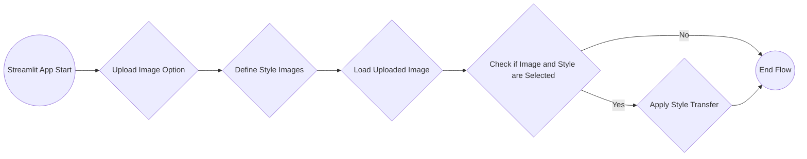

# 🎈 Image Style Transfer

A simple Streamlit app template for you to modify!

[](https://blank-app-template.streamlit.app/)

### How to run it on your own machine

1. Download the repository
   ```
   $ git clone https://github.com/aniketyevankar/image-style-transfer.git
   ```

2. Install the requirements

   ```
   $ pip install -r requirements.txt
   ```

3. Run the app

   ```
   $ streamlit run streamlit_app.py
   ```

### Flow
